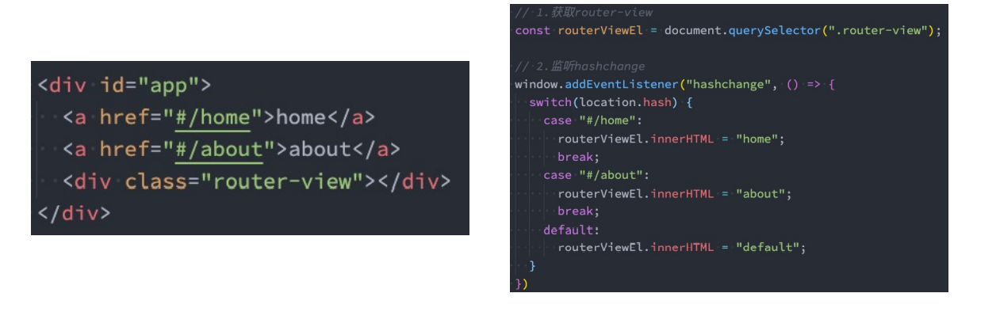
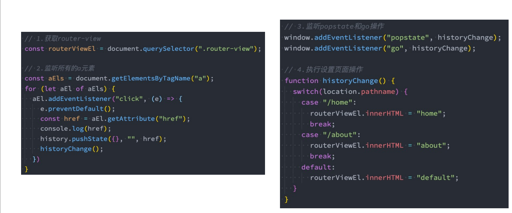

# 认识前端路由

- 路由其实是网络工程中的一个术语： 
  - 在**架构一个网络**时，非常重要的两个设备就是**路由器和交换机**。 
  - 当然，目前在我们生活中路由器也是越来越被大家所熟知，因为我们生活中都会用到**路由器**： 
  - 事实上，**路由器**主要维护的是一个**映射表**； 
  - **映射表**会决定数据的流向； 
- 路由的概念在软件工程中出现，最早是在后端路由中实现的，原因是web的发展主要经历了这样一些阶段： 
  - 后端路由阶段； 
  - 前后端分离阶段； 
  - 单页面富应用（SPA）；

## 后端路由阶段

- 早期的网站开发整个HTML页面是由服务器来渲染的. 
  - 服务器直接**生产渲染好对应的HTML页面**, 返回给客户端进行展示. 
- 但是, 一个网站, 这么多页面服务器如何处理呢? 
  - 一个页面有**自己对应的网址**, 也就是**URL**； 
  - URL会发送到服务器, 服务器会通过**正则对该URL进行匹配**, 并且最后交给一个Controller进行处理； 
  - Controller进行各种处理, 最终生成HTML或者数据, 返回给前端. 
- 上面的这种操作, 就是后端路由： 
  - 当我们页面中需要**请求不同的路径内容时**, 交给服务器来进行处理, 服务器渲染好**整个页面**, 并且将页面返回给客户端. 
  - 这种情况下渲染好的页面, **不需要单独加载任何的js和css**, 可以直接交给**浏览器展示**, 这样也有**利于SEO的优化**. 
- 后端路由的缺点: 
  - 一种情况是**整个页面的模块由后端人员来编写和维护的**； 
  - 另一种情况是**前端开发人员如果要开发页面, 需要通过PHP和Java等语言来编写页面代码**； 
  - 而且通常情况下**HTML代码和数据以及对应的逻辑会混在一起**, 编写和维护都是非常糟糕的事情

## 前后端分离阶段

- 前端渲染的理解： 
  - 每次请求涉及到的静态资源都会从静态资源服务器获取，这些资源包括HTML+CSS+JS，**然后在前端对这些请 求回来的资源进行渲染**； 
  - 需要注意的是，客户端的每一次请求，都会从**静态资源服务器请求文件**； 
  - 同时可以看到，和之前的后端路由不同，这时后端只是**负责提供API了**； 
- 前后端分离阶段： p随着Ajax的出现, 有了前**后端分离的开发模式**； 
  - 后端只提供API来返回数据，前端通过**Ajax获取数据**，并且可以**通过JavaScript将数据渲染到页面中**； 
  - 这样做最大的优点就是**前后端责任的清晰，后端专注于数据上，前端专注于交互和可视化上**； 
  - 并且当**移动端(iOS/Android)**出现后，后端不需要进行任何处理，依然使用之前的一套API即可； 
  - 目前比较少的网站采用这种模式开发（jQuery开发模式）；

# URL的hash

- 前端路由是如何做到URL和内容进行映射呢？监听URL的改变。 
- URL的hash 
  - URL的hash也就是锚点(#), 本质上是改变window.location的href属性； 
  - 我们可以通过直接赋值location.hash来改变href, 但是页面不发生刷新；



- hash的优势就是兼容性更好，在老版IE中都可以运行，但是缺陷是有一个#，显得不像一个真实的路径。

# HTML5的History

- history接口是HTML5新增的, 它有l六种模式改变URL而不刷新页面： 
- replaceState：替换原来的路径； 
- pushState：使用新的路径； 
- popState：路径的回退； 
- go：向前或向后改变路径； 
- forward：向前改变路径； 
- back：向后改变路径；

## HTML5的History演练



# 认识vue-router

- 目前前端流行的三大框架, 都有自己的路由实现: 
  - Angular的NgRouter 
  - React的ReactRouter 
  - Vue的vue-router 
- Vue Router 是 Vue.js 的官方路由。它与 Vue.js 核心深度集成，让用 Vue.js 构建单页应用变得非常容易。 
  - 目前Vue路由最新的版本是4.x版本，我们上课会基于最新的版本讲解。 
- vue-router是基于路由和组件的
  - 路由用于设定访问路径, 将路径和组件映射起来. 
  - 在vue-router的单页面应用中, 页面的路径的改变就是组件的切换. 
- 安装Vue Router：

>npm install vue-router@4

# vue-router的使用

## 配置映射关系

```javascript
import Home from '../pages/Home.vue';
import About from '../pages/About.vue';

// 配置映射关系
const routes = [
  { path: '/home', component: Home },
  { path: '/about', component: About },
];
```

## 创建router

```javascript
import {
  createRouter,
  createWebHistory,
  createWebHashHistory,
} from 'vue-router';
import Home from '../pages/Home.vue';
import About from '../pages/About.vue';

// 配置映射关系
const routes = [
  { path: '/home', component: Home },
  { path: '/about', component: About },
];

// 创建一个路由对象router
const router = createRouter({
  routes,
  history: createWebHistory(),
});

export default router;

```

## router-view

```javascript
<template>
  <div id="app">
    <h2>哈哈哈</h2>
    <div>呵呵呵呵</div>
    <router-view />
  </div>
</template>

<script>
export default {
  name: "App",
  components: {},
};
</script>

<style>
</style>

```

### router-view的v-slot

- router-view也提供给我们一个插槽，可以用于<transition>  和<transition>  组件来包裹你的路由组件： 
  - Component：要渲染的组件； 
  - route：解析出的标准化路由对象；


## router-link

```javascript
<template>
  <div id="app">
    <router-link to="/home">首页</router-link>
    <router-link to="/about">关于</router-link>
    <router-view />
  </div>
</template>
```

### router-link的属性

- router-link事实上有很多属性可以配置： 
- to属性： 
  - 是一个字符串，或者是一个对象 
- replace属性： 
  - 设置 replace 属性的话，当点击时，会调用 router.replace()，而不是 router.push()； 
- active-class属性： 
  - 设置激活a元素后应用的class，默认是router-link-active 
- exact-active-class属性： 
  - 链接精准激活时，应用于渲染的<a>的 class，默认是router-link-exact-active；


### router-link的v-slot

- 在vue-router3.x的时候，router-link有一个tag属性，可以决定router-link到底渲染成什么元素： 
  - 但是在vue-router4.x开始，该属性被移除了； 
  - 而给我们提供了更加具有灵活性的v-slot的方式来定制渲染的内容； 
- v-slot如何使用呢？ 
- 首先，我们需要使用custom表示我们整个元素要自定义 
  - 如果不写，那么自定义的内容会被包裹在一个 a 元素中； 
- 其次，我们使用v-slot来作用域插槽来获取内部传给我们的值：


## 配置默认路径

```javascript
// 配置映射关系
const routes = [
  { path: '/', component: Home },
  { path: '/home', component: Home },
  { path: '/about', component: About },
];
```

## 路由重定向

```javascript
// 配置映射关系
const routes = [
  { path: '/', redirect: '/home' },
  { path: '/home', component: Home },
  { path: '/about', component: About },
];
```

## 路由懒加载

- 当打包构建应用时，JavaScript 包会变得非常大，影响页面加载： 
  - 如果我们能把不同路由对应的组件分割成不同的代码块，然后当路由被访问的时候才加载对应组件，这样就会 更加高效； 
  - 也可以提高首屏的渲染效率； 
- 其实这里还是我们前面讲到过的webpack的分包知识，而Vue Router默认就支持动态来导入组件：
  - 这是因为component可以传入一个组件，也可以接收一个函数，该函数 需要放回一个Promise；
  - 而import函数就是返回一个Promise；

```javascript
const routes = [
  { path: '/', redirect: '/home' },
  { path: '/home', component: () => import('../pages/Home.vue') },
  { path: '/about', component: () => import('../pages/About.vue') },
];
```

## 路由的其他属性


## 动态路由基本匹配

- 很多时候我们需要将给定匹配模式的路由映射到同一个组件： 
  - 例如，我们可能有一个 User 组件，它应该对所有用户进行渲染，但是用户的ID是不同的； 
  - 在Vue Router中，我们可以在路径中使用一个动态字段来实现，我们称之为 路径参数；

```javascript
{
    path: '/user/:username',
    component: () => import('../pages/User.vue'),
},
```

- 在router-link中进行如下跳转：

```vue
<router-link to="/user/zytqyb"> 用户</router-link>
```

### 匹配多个参数

```javascript
{
    path: '/user/:id/info/:name',
    component: () => import('../pages/User.vue'),
},
```


## 获取动态路由的值

- 那么在User中如何获取到对应的值呢？ 
  - 在template中，直接通过 $route.params获取值； 
    - 在created中，通过 this.$route.params获取值； 
    - 在setup中，我们要使用 vue-router库给我们提供的一个hook useRoute； 
      - 该Hook会返回一个Route对象，对象中保存着当前路由相关的值；


## NotFound

- 对于哪些没有匹配到的路由，我们通常会匹配到固定的某个页面 
  - 比如NotFound的错误页面中，这个时候我们可编写一个动态路由用于匹配所有的页面；

```javascript
{
    path: '/:pathMatch(.*)',
    component: () => import('../pages/NotFound.vue')
}
```

- 我们可以通过 $route.params.pathMatch获取到传入的参数：

```javascript
<h1>{{ $route.params.pathMatch }}</h1>
```

### 匹配规则加*

- 这里还有另外一种写法： 
  - 注意：我在/:pathMatch(.*)后面又加了一个 *；


- 它们的区别在于解析的时候，是否解析 /：

  

## 路由的嵌套

- 什么是路由的嵌套呢？
  - 目前我们匹配的Home、About、User等都属于底层路由，我们在它们之间可以来回进行切换； 
  - 但是呢，我们Home页面本身，也可能会在多个组件之间来回切换： 
    - 比如Home中包括Product、Message，它们可以在Home内部来回切换；
  - 这个时候我们就需要使用嵌套路由，在Home中也使用 router-view 来占位之后需要渲染的组件；

### 路由的嵌套配置

```javascript
{
    path: '/home',
    name: 'home',
    component: () => import('../pages/Home.vue'),
    meta: {
      name: 'why',
      age: 18,
      height: 1.88,
    },
    children: [
      {
        path: '/home/message',
        component: () => import('../pages/HomeMessage.vue')
      },
      {
        path: '/home/shops',
        component: () => import('../pages/HomeShops.vue')
      }
    ]
},
```

## 编程式导航

- 有时候我们希望通过代码来完成页面的跳转，比如点击的是一个按钮：


- 当然，我们也可以传入一个对象:


- 如果是在setup中编写的代码，那么我们可以通过 useRouter 来获取：


# 动态添加路由

- 某些情况下我们可能需要动态的来添加路由： 
  - 比如根据用户不同的权限，注册不同的路由； 
  - 这个时候我们可以使用一个方法 addRoute； 
- 如果我们是为route添加一个children路由，那么可以传入对应的name：


# 动态删除路由

- 删除路由有以下三种方式： 
  - 方式一：添加一个name相同的路由； 
  - 方式二：通过removeRoute方法，传入路由的名称； 
  - 方式三：通过addRoute方法的返回值回调；


- 路由的其他方法补充： 
  - router.hasRoute()：检查路由是否存在。 
  - router.getRoutes()：获取一个包含所有路由记录的数组。

# 路由导航守卫

- vue-router 提供的导航守卫主要用来通过跳转或取消的方式守卫导航。 
- 全局的前置守卫beforeEach是在导航触发时会被回调的： 
- 它有两个参数： 
  - to：即将进入的路由Route对象； 
  - from：即将离开的路由Route对象； 
- 它有返回值： 
  - false：取消当前导航； 
  - 不返回或者undefined：进行默认导航； 
  - 返回一个路由地址： 
    - 可以是一个string类型的路径； 
    - 可以是一个对象，对象中包含path、query、params等信息； 
- 可选的第三个参数：next 
  - 在Vue2中我们是通过next函数来决定如何进行跳转的；
  -  但是在Vue3中我们是通过返回值来控制的，不再推荐使用next函数，这是因为开发中很容易调用多次next；


>导航守卫返回值问题

1.  fasle: 不进行导航
2.  undefined或者不返回: 进行默认跳转
3.  字符串: 路径, 跳转到对应的路径
4.  对象: 类型于 router.push({path: '/login', quert: .....})

 

## 登录守卫功能


# 其他导航守卫

- Vue还提供了很多的其他守卫函数，目的都是在某一个时刻给予我们回调，让我们可以更好的控制程序的流程或者功能： 
  - https://next.router.vuejs.org/zh/guide/advanced/navigation-guards.html 
- 我们一起来看一下完整的导航解析流程： 
  - 导航被触发。 
  - 在失活的组件里调用 beforeRouteLeave 守卫。 
  - 调用全局的 beforeEach 守卫。 
  - 在重用的组件里调用 beforeRouteUpdate 守卫(2.2+)。 
  - 在路由配置里调用 beforeEnter。 
  - 解析异步路由组件。 
  - 在被激活的组件里调用 beforeRouteEnter。 
  - 调用全局的 beforeResolve 守卫(2.5+)。 
  - 导航被确认。 
  - 调用全局的 afterEach 钩子。 
  - 触发 DOM 更新。 
  - 调用 beforeRouteEnter 守卫中传给 next 的回调函数，创建好的组件实例会作为回调函数的参数传入。