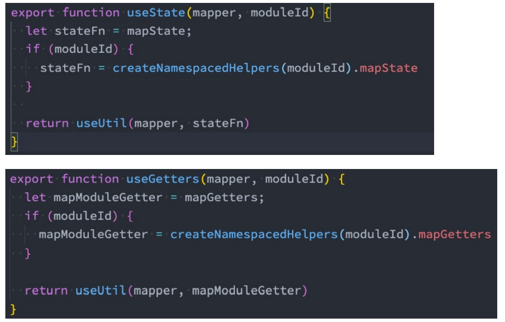

# Vuex的安装

- 依然我们要使用vuex，首先第一步需要安装vuex： 
  - 我们这里使用的是vuex4.x，安装的时候需要添加 next 指定版本；

>npm install vuex@next

# Vuex的使用

## 创建Store

```javascript
import { createStore } from 'vuex';

const store = createStore({
  state() {
    return {
      counter: 100,
    };
  },
  mutations: {
    increment(state) {
      state.counter++;
    },
    decrement(state) {
      state.counter--;
    },
  },
});

export default store;

```

## 在main.js挂载store

```javascript
import { createApp } from 'vue'
import App from './App.vue'
import store from './store'

createApp(App).use(store).mount('#app')

```

## 在组件中使用和修改store

```javascript
<template>
  <div>
    <h2>App:{{ $store.state.counter }}</h2>

    <button @click="increment">+1</button>
    <button @click="decrement">-1</button>
  </div>
</template>

<script>
import HelloWorld from "./components/HelloWorld.vue";

export default {
  name: "App",
  components: {
    HelloWorld,
  },
  data() {
    return {
      counter: 0,
    };
  },
  methods: {
    increment() {
      this.$store.commit("increment");
    },
    decrement() {
      this.$store.commit("decrement");
    },
  },
};
</script>

<style>
#app {
  font-family: Avenir, Helvetica, Arial, sans-serif;
  -webkit-font-smoothing: antialiased;
  -moz-osx-font-smoothing: grayscale;
  text-align: center;
  color: #2c3e50;
  margin-top: 60px;
}
</style>

```

# mapState辅助函数

## 基本使用

```javascript
<template>
  <div>
    <h2>{{ sCounter }}</h2>
    <h2>{{ sCounter }}</h2>
  </div>
</template>

<script>
import { mapState } from "vuex";
export default {
  computed: {
    fullName() {
      return "123123";
    },
    // ...mapState(["counter", "name"]),
    ...mapState({
      sCounter: (state) => state.counter,
      sCounter: (state) => state.name,
    }),
  },
};
</script>

<style scoped>
</style>
```

## 在setup中使用mapState

- 在setup中如果我们单个获取装是非常简单的： 
  - 通过useStore拿到store后去获取某个状态即可； 
  - 但是如果我们需要使用 mapState 的功能呢？ 
- 默认情况下，Vuex并没有提供非常方便的使用mapState的方式，这里我们进行了一个函数的封装：


## 对mapState进行封装达到直接使用的目的

```javascript
import { mapState, useStore } from 'vuex';
import { computed } from 'vue';
export function useState(mapper) {
  const store = useStore();
  const storeStateFns = mapState(mapper);

  const storeState = {};
  Object.keys(storeStateFns).forEach((fnKey) => {
    const fn = storeStateFns[fnKey].bind({ $store: store });
    storeState[fnKey] = computed(fn);
  });

  return storeState;
}

```

# getters的基本使用

- 某些属性我们可能需要经过变化后来使用，这个时候可以使用getters：


## getters第二个参数

## getters的返回函数


## mapGetters的辅助函数

- 这里我们也可以使用mapGetters的辅助函数。


- 在setup中使用


# Mutation基本使用

更改 Vuex 的 store 中的状态的唯一方法是提交 mutation：


## Mutation携带数据

- 很多时候我们在提交mutation的时候，会携带一些数据，这个时候我们可以使用参数：


## Mutation常量类型


## mapMutations辅助函数

## mutation重要原则

- 一条重要的原则就是要记住 mutation 必须是同步函数 
  - 这是因为devtool工具会记录mutation的日记；
  - 每一条mutation被记录，devtools都需要捕捉到前一状态和后一状态的快照； 
  - 但是在mutation中执行异步操作，就无法追踪到数据的变化； 
  - 所以Vuex的重要原则中要求 mutation必须是同步函数；

# actions的基本使用

- Action类似于mutation，不同在于： 
  - Action提交的是mutation，而不是直接变更状态； 
  - Action可以包含任意异步操作； 
- 这里有一个非常重要的参数context： 
  - context是一个和store实例均有相同方法和属性的context对象； 
  - 所以我们可以从其中获取到commit方法来提交一个mutation，或者通过 context.state 和 context.getters 来 获取 state 和 getters； 
  - 但是为什么它不是store对象呢？这个等到我们讲Modules时再具体来说；


## actions的分发操作

- 如何使用action呢？进行action的分发： 
  - 分发使用的是 store 上的dispatch函数；


- 同样的，它也可以携带我们的参数：


- 也可以以对象的形式进行分发：


## actions的辅助函数

- action也有对应的辅助函数： 
- 对象类型的写法； 
- 数组类型的写法；


## actions的异步操作

- Action 通常是异步的，那么如何知道 action 什么时候结束呢？ 
  - 我们可以通过让action返回Promise，在Promise的then中来处理完成后的操作；


# module的基本使用

- 什么是Module？ 
  - 由于使用单一状态树，应用的所有状态会集中到一个比较大的对象，当应用变得非常复杂时，store 对象就有可 能变得相当臃肿； 
  - 为了解决以上问题，Vuex 允许我们将 store 分割成模块（module）； 
  - 每个模块拥有自己的 state、mutation、action、getter、甚至是嵌套子模块；


## module的局部状态

- 对于模块内部的 mutation 和 getter，接收的第一个参数是模块的局部状态对象：


## module的命名空间

- 默认情况下，模块内部的action和mutation仍然是注册在全局的命名空间中的： 
  - 这样使得多个模块能够对同一个 action 或 mutation 作出响应； 
  - Getter 同样也默认注册在全局命名空间； 
- 如果我们希望模块具有更高的封装度和复用性，可以添加 namespaced: true 的方式使其成为带命名空间的模块： 
  - 当模块被注册后，它的所有 getter、action 及 mutation 都会自动根据模块注册的路径调整命名；


## module修改或派发根组件

- 如果我们希望在action中修改root中的state，那么有如下的方式：


## module的辅助函数

- 如果辅助函数有三种使用方法： 
  - 方式一：通过完整的模块空间名称来查找； 
  - 方式二：第一个参数传入模块空间名称，后面写上要使用的属性； 
  - 方式三：通过 createNamespacedHelpers 生成一个模块的辅助函数；


第三种方式： createNamespacedHelpers


## 对useState和useGetters修改



