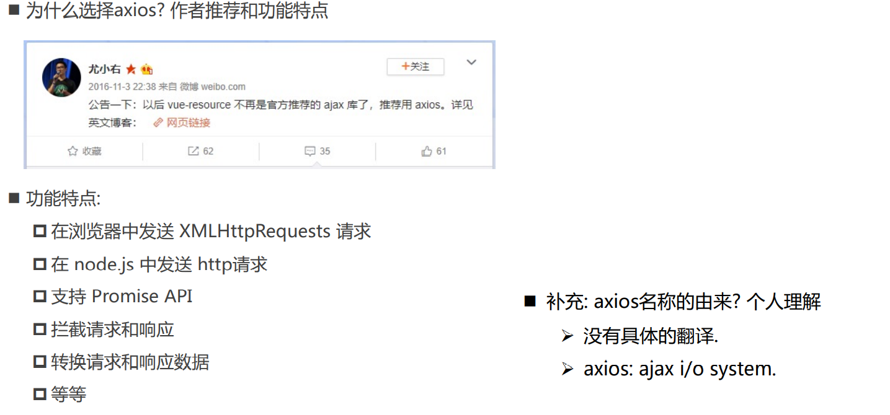
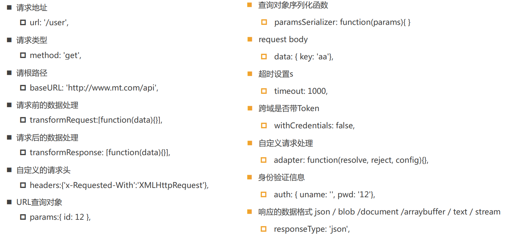

# 认识axios



# axios请求方式

 支持多种请求方式: 

- axios(config) 
- axios.request(config) 
- axios.get(url[, config]) 
- axios.delete(url[, config]) 
- axios.head(url[, config]) 
- axios.post(url[, data[, config]]) 
- axios.put(url[, data[, config]]) 
- axios.patch(url[, data[, config]]) 
- 有时候, 我们可能需求同时发送两个请求 
  - 使用axios.all, 可以放入多个请求的数组. 
  - axios.all([]) 返回的结果是一个数组，使用 axios.spread 可将数组 [res1,res2] 展开为 res1, res2

# 常见的配置选项



# axios的实例和拦截器

- 为什么要创建axios的实例呢? 
  - 当我们从axios模块中导入对象时, 使用的实例是默认的实例. 
  - 当给该实例设置一些默认配置时, 这些配置就被固定下来了. 
  - 但是后续开发中, 某些配置可能会不太一样. 
  - 比如某些请求需要使用特定的baseURL或者timeout或者content-Type等. 
  - 这个时候, 我们就可以创建新的实例, 并且传入属于该实例的配置信息.

- axios的也可以设置拦截器：拦截每次请求和响应 
  - axios.interceptors.request.use(请求成功拦截, 请求失败拦截) 
  - axios.interceptors.response.use(响应成功拦截, 响应失败拦截)

# 对axios进行封装

```typescript
import axios from 'axios'
import type { AxiosInstance, AxiosRequestConfig } from 'axios'
import type { QYBRequestConfig, QYBRequestInterceptors } from './type'

class QYBRequest {
  instance: AxiosInstance
  interceptors?: QYBRequestInterceptors
  constructor(config: QYBRequestConfig) {
    this.instance = axios.create(config)
    this.interceptors = config.interceptors

    // 从config中取出的拦截器是对应实例的拦截器
    this.instance.interceptors.request.use(
      this.interceptors?.requestInterceptor,
      this.interceptors?.requestInterceptorCatch
    )
    this.instance.interceptors.response.use(
      this.interceptors?.responseInterceptor,
      this.interceptors?.responseInterceptorCatch
    )

    // 添加所有实例都有的拦截器
    this.instance.interceptors.request.use(
      (config) => {
        return config
      },
      (err) => {
        return err
      }
    )

    this.instance.interceptors.response.use(
      (res) => {
        return res
      },
      (err) => {
        return err
      }
    )
  }

  request(config: AxiosRequestConfig): void {
    this.instance.request(config).then((res) => {
      console.log(res)
    })
  }
}

export default QYBRequest

```

