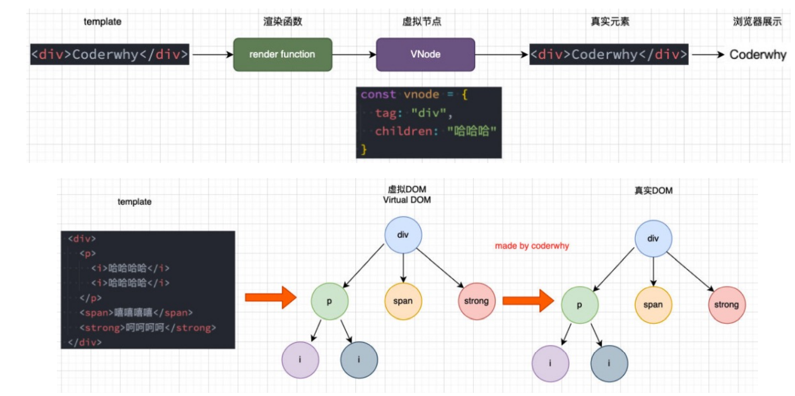

# 虚拟DOM

## 虚拟DOM的优势


## 虚拟DOM的渲染过程



# Vue三大核心系统


## 三大系统协同工作


# 渲染器的实现

## **h**函数

```javascript
const h = (tag, props, children) => {
  // vnode -> javascript对象 -> {}
  return {
    tag,
    props,
    children,
  };
};
```


## **mount**函数的实现

```javascript
const h = (tag, props, children) => {
  // vnode -> javascript对象 -> {}
  return {
    tag,
    props,
    children,
  };
};

const mount = (vnode, container) => {
  // vnode -> element

  // 1.创建出真是的原生, 并且在vnode中保留el
  const el = (vnode.el = document.createElement(vnode.tag));

  // 2.处理props
  if (vnode.props) {
    for (const key in vnode.props) {
      const value = vnode.props[key];
      if (key.startsWith('on')) {
        el.addEventListener(key.slice(2).toLowerCase(), value);
      } else {
        el.setAttribute(key, value);
      }
    }
  }

  // 3.处理children
  if (vnode.children) {
    if (typeof vnode.children === 'string') {
      el.textContent = vnode.children;
    } else {
      vnode.children.forEach((item) => {
        mount(item, el);
      });
    }
  }

  // 4.将el挂载到container上
  container.appendChild(el);
};

```

## **patch**函数的实现

```javascript
const patch = (n1, n2) => {
  if (n1.tag !== n2.tag) {
    const n1ElOarent = n1.el.parentElement;
    n1ElOarent.removeChild(n1.el);
    mount(n2, n1ElOarent);
  } else {
    // 1.去除element对象, 并且在n2进行保存
    const el = (n2.el = n1.el);

    // 2.处理props
    const oldProps = n1.props || {};
    const newProps = n2.props || {};

    // 2.1获取所有的newProps添加到el
    for (const key in newProps) {
      const oldValue = oldProps[key];
      const newValue = newProps[key];

      if (newValue !== oldValue) {
        if (key.startsWith('on')) {
          el.addEventListener(key.slice(2).toLowerCase(), newValue);
        } else {
          el.setAttribute(key, newValue);
        }
      }
    }

    // 2.2 删除旧的props
    for (const key in oldProps) {
      if (!(key in newProps)) {
        if (key.startsWith('on')) {
          const value = oldProps[key];
          el.removeEventListener(key.slice(2).toLowerCase(), value);
        } else {
          el.removeAttribute(key);
        }
      }
    }

    // 3.处理children
    const oldChildren = n1.children || [];
    const newChildren = n2.children || [];

    if (typeof newChildren === 'string') {
      // 情况一: newChildren本身是一个string
      // 边界判断(edge case)
      if (typeof oldChildren === 'string') {
        if (newChildren !== oldChildren) {
          el.innerHTML = newChildren;
        }
      } else {
        el.innerHTML = newChildren;
      }
    } else {
      /// 情况二: newChildren本身是一个数组
      if (typeof oldChildren === 'string') {
        el.innerHTML = '';
        newChildren.forEach((item) => {
          mount(item, el);
        });
      } else {
        // oldChildren: [v1, v2, v3]
        // newChildren: [v1, v5, v6, v8, v9]
        // 1.前面有相同节点的原生进行patch操作
        const commonLength = Math.min(oldChildren.length, newChildren.length);
        for (let i = 0; i < commonLength; i++) {
          patch(oldChildren[i], newChildren[i]);
        }

        // 2.newChildren.length > oldChildren.lentgh
        if (newChildren.length > oldChildren.length) {
          newChildren.slice(oldChildren.length).forEach((item) => {
            mount(item, el);
          });
        }

        // 3.newChildren.lentgh < oldChildren.lentgh
        if (newChildren.length < oldChildren.length) {
          oldChildren.slice(newChildren.length).forEach((item) => {
            el.removeChild(item.el);
          });
        }
      }
    }
  }
};
```

# 响应式系统的实现

## Dep函数实现

```javascript
class Dep {
  constructor() {
    this.subscriber = new Set();
  }

  addEffect(effect) {
    this.subscriber.add(effect);
  }

  notify() {
    this.subscriber.forEach((effect) => {
      effect();
    });
  }
}

const info = { counter: 100 };

const dep = new Dep();

function doubleCounter() {
  console.log(info.counter * 2);
}

function powerCounter() {
  console.log(info.counter * info.counter);
}

dep.addEffect(doubleCounter);
dep.addEffect(powerCounter);

info.counter++;
dep.notify();

```

## 响应式系统Vue2实现

```javascript
class Dep {
  constructor() {
    this.subscriber = new Set();
  }

  depend() {
    if (activeEffect) {
      this.subscriber.add(activeEffect);
    }
  }

  addEffect(effect) {
    this.subscriber.add(effect);
  }

  notify() {
    this.subscriber.forEach((effect) => {
      effect();
    });
  }
}

let activeEffect = null;

function watchEffect(effect) {
  activeEffect = effect;
  effect();
  activeEffect = null;
}

// Map({key: value}): key是一个字符串
// WeakMap({key(对象): value}): key是一个对象吗, 弱引用

const targetMap = new WeakMap();
function getDep(target, key) {
  // 1. 根据对象(target)取出对应的Map对象
  let depsMap = targetMap.get(target);
  if (!depsMap) {
    depsMap = new Map();
    targetMap.set(target, depsMap);
  }

  // 2. 取出具体的dep对象
  let dep = depsMap.get(key);
  if (!dep) {
    dep = new Dep();
    depsMap.set(key, dep);
  }
  return dep;
}

// vue2对row进行数据劫持
function reactive(raw) {
  Object.keys(raw).forEach((key) => {
    const dep = getDep(raw, key);
    let value = raw[key];
    Object.defineProperty(raw, key, {
      get() {
        dep.depend();
        return value;
      },
      set(newValue) {
        if (value !== newValue) {
          value = newValue;
          dep.notify();
        }
      },
    });
  });
  return raw;
}

// 测试代码
const info = reactive({ counter: 100, name: 'why' });
info.name = '12312312';

const foo = reactive({ height: 1.88 });

const dep = new Dep();

// watchEffect1
watchEffect(function () {
  console.log('effect1', info.counter * 2, info.name);
});

// watchEffect2
watchEffect(function () {
  console.log('effect2', info.counter * info.counter, info.name);
});

// watchEffect3
watchEffect(function () {
  console.log('effect3', info.counter + 10, info.name);
});

// watchEffect4
watchEffect(function () {
  console.log('effect4', foo.height);
});

// info.counter++;
// info.name = 'lesda';
foo.height = 2;

```

## 响应式系统Vue3实现

```javascript
// vue3对row进行数据劫持
function reactive(raw) {
  return new Proxy(raw, {
    get(target, key) {
      const dep = getDep(target, key);
      dep.depend();
      return targey[key];
    },

    set(target, key, newValue) {
      const dep = getDep(target, key);
      target[key] = newValue;
      dep.notify();
    },
  });
}
```

