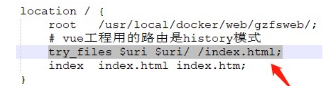

# nexttick

- 官方解释：将回调推迟到下一个 DOM 更新周期之后执行。在更改了一些数据以等待 DOM 更新后立即使用它。 
- 比如我们有下面的需求： 
  - 点击一个按钮，我们会修改在h2中显示的message； 
  - message被修改后，获取h2的高度； 
- 实现上面的案例我们有三种方式： 
  - 方式一：在点击按钮后立即获取到h2的高度（错误的做法） 
  - 方式二：在updated生命周期函数中获取h2的高度（但是其他数据更新，也会执行该操作） 
  - 方式三：使用nexttick函数； 
- nexttick是如何做到的呢？

# historyApiFallback

- historyApiFallback是开发中一个非常常见的属性，它主要的作用是解决SPA页面在路由跳转之后，进行页面刷新 时，返回404的错误。 
- boolean值：默认是false 
  - 如果设置为true，那么在刷新时，返回404错误时，会自动返回 index.html 的内容； 
- object类型的值，可以配置rewrites属性： 
  - 可以配置from来匹配路径，决定要跳转到哪一个页面； 
- 事实上devServer中实现historyApiFallback功能是通过connect-history-api-fallback库的： 
  - 可以查看connect-history-api-fallback 文档

